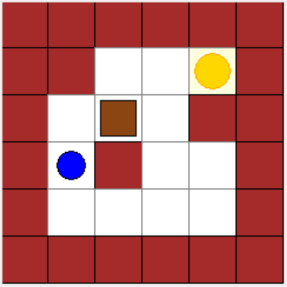
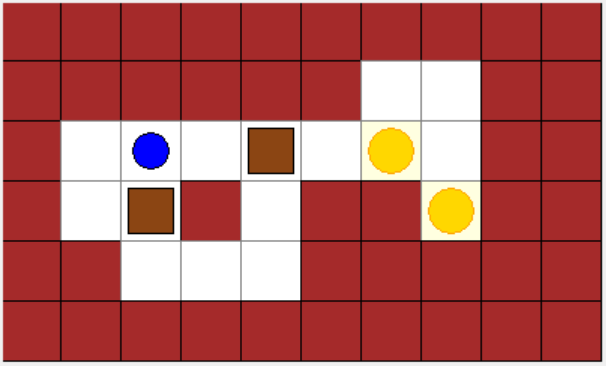

# 推箱子(Sokoban) 

## a) 搜索算法的设计思路

搜索算法采用 **A\* 搜索算法**来求解推箱子问题的最短路径，同时结合**死锁剪枝**以提高搜索效率。

### 1. 状态定义
$S = (\text{玩家位置}, \text{不可变箱子位置集合})$

这个状态是便于哈希的，可以使用python内部实现的hashmap维护visited集合和优先队列。


### 2. 状态转移 $g(n)$

$g(n)$ 为从起始点到当前状态的实际移动步数，每步成本为 1。

**状态转移获取 next_state 的逻辑简述：**

对于每个方向（上、下、左、右），判断玩家是否可以移动：
- 如果前方是地板/目标点且无箱子，则玩家直接移动。
- 如果前方是箱子，且箱子后方是地板/目标点且无其他箱子，则玩家推动箱子，箱子前进一格。
- 推箱子后若箱子进入非目标点死角，则该状态被剪枝。(死锁剪枝详见后文)
每种合法移动都会生成一个新的状态 (next_state)，用于A*扩展。

### 3. 启发函数 $h(n)$

启发函数 $h(n)$ 采用**所有未归位箱子到最近可用目标点的曼哈顿距离之和**的贪心最小匹配策略。

1.  **目标点匹配：** 遍历所有箱子，将其贪心地匹配给距离最近的、且尚未被其他箱子匹配的目标点。
2.  **距离计算：** 使用曼哈顿距离 $d = |x_1 - x_2| + |y_1 - y_2|$。
3.  **结果：** 将这些最小匹配距离求和得到 $h(n)$。

**证明（最短路径保证）：**
该启发函数 $h(n)$ 是**可接受的**。

* **推导：** 任何箱子要到达目标点，所需的最少推力次数**至少**等于它们之间的曼哈顿距离。
* **判断：** $h(n)$ 忽略了以下因素：玩家移动、箱子间和墙壁的路径阻碍、以及将箱子推到正确位置的复杂性，从而**低估**了实际成本 $h^*(n)$，
* **结论：** 由于 $h(n) \le h^*(n)$（估计代价 $\le$ 实际最小代价），A\* 算法在找到第一个目标状态时，即可保证该路径是全局最短路径。

### 4. 优先队列
使用 Python 的 `heapq` 实现，根据 $f(n) = g(n) + h(n)$ 排序，优先扩展 $f$ 值最小的节点。

### 5. 目标判断
判断所有箱子的位置是否都包含在目标点集合内。若是，则找到了终极解。

### 6. 死锁剪枝

**剪枝规则：**

* 在玩家执行**推箱子**操作后，如果箱子被推到了一个**非目标点**的位置，且该位置满足以下任一**角落条件**：
    * 上/下是墙，且左/右是墙（即形成墙角）。
* 一旦满足上述条件，则该新状态被认定为**死锁**，立即被**丢弃**，不加入优先队列。

**效果：** 有效避免了对不可解分支的探索，极大地压缩了搜索空间和求解时间。

## b) 搜索算法的结果演示
### 例1：单箱子简单关卡

```
[A* Step 0] f=3, g=0, player=(3, 1), boxes=[(2, 2)], move=None
[A* Step 1] f=4, g=1, player=(2, 1), boxes=[(2, 2)], move=u
[A* Step 2] f=4, g=1, player=(4, 1), boxes=[(2, 2)], move=d
[A* Step 3] f=4, g=2, player=(2, 2), boxes=[(2, 3)], move=R
[A* Step 4] f=5, g=2, player=(4, 2), boxes=[(2, 2)], move=r
[A* Step 5] f=5, g=3, player=(1, 2), boxes=[(2, 3)], move=u
[A* Step 6] f=5, g=3, player=(2, 1), boxes=[(2, 3)], move=l
[A* Step 7] f=6, g=3, player=(4, 3), boxes=[(2, 2)], move=r
[A* Step 8] f=6, g=4, player=(1, 3), boxes=[(2, 3)], move=r
[A* Step 9] f=6, g=4, player=(3, 1), boxes=[(2, 3)], move=d
[A* Step 10] f=7, g=4, player=(3, 3), boxes=[(2, 2)], move=u
[A* Step 11] f=7, g=4, player=(4, 4), boxes=[(2, 2)], move=r
[A* Step 12] f=7, g=5, player=(1, 4), boxes=[(2, 3)], move=r
[A* Step 13] f=7, g=5, player=(4, 1), boxes=[(2, 3)], move=d
[A* Step 14] f=8, g=5, player=(2, 3), boxes=[(3, 3)], move=D
[A* Step 15] f=8, g=5, player=(2, 3), boxes=[(2, 2)], move=u
[A* Step 16] f=8, g=5, player=(3, 4), boxes=[(2, 2)], move=r
[A* Step 17] f=8, g=6, player=(4, 2), boxes=[(2, 3)], move=r
[A* Step 18] f=9, g=6, player=(1, 3), boxes=[(2, 2)], move=u
[A* Step 19] f=9, g=6, player=(1, 3), boxes=[(3, 3)], move=u
[A* Step 20] f=9, g=6, player=(2, 2), boxes=[(3, 3)], move=l
[A* Step 21] f=9, g=7, player=(4, 3), boxes=[(2, 3)], move=r
[A* Step 22] f=10, g=6, player=(3, 3), boxes=[(4, 3)], move=D
[A* Step 23] f=10, g=7, player=(1, 2), boxes=[(3, 3)], move=l
[A* Step 24] f=10, g=7, player=(1, 2), boxes=[(2, 2)], move=l
[A* Step 25] f=10, g=7, player=(1, 4), boxes=[(3, 3)], move=r
[A* Step 26] f=10, g=7, player=(1, 4), boxes=[(2, 2)], move=r
[A* Step 27] f=10, g=7, player=(2, 1), boxes=[(3, 3)], move=l
[A* Step 28] f=10, g=8, player=(3, 3), boxes=[(2, 3)], move=u
[A* Step 29] f=10, g=8, player=(4, 4), boxes=[(2, 3)], move=r
[A* Step 30] f=10, g=9, player=(2, 3), boxes=[(1, 3)], move=U
[A* Step 31] f=11, g=7, player=(2, 3), boxes=[(4, 3)], move=u
[A* Step 32] f=11, g=7, player=(3, 4), boxes=[(4, 3)], move=r
[A* Step 33] f=11, g=8, player=(3, 1), boxes=[(3, 3)], move=d
[A* Step 34] f=11, g=9, player=(3, 4), boxes=[(2, 3)], move=r
[A* Step 35] f=11, g=10, player=(2, 2), boxes=[(1, 3)], move=l
[A* Step 36] f=11, g=10, player=(3, 3), boxes=[(1, 3)], move=d
[A* Step 37] f=12, g=8, player=(1, 3), boxes=[(4, 3)], move=u
[A* Step 38] f=12, g=8, player=(2, 2), boxes=[(4, 3)], move=l
[A* Step 39] f=12, g=8, player=(4, 4), boxes=[(4, 3)], move=d
[A* Step 40] f=12, g=9, player=(4, 1), boxes=[(3, 3)], move=d
[A* Step 41] f=12, g=11, player=(1, 2), boxes=[(1, 3)], move=u
[A* Step 42] f=12, g=11, player=(2, 1), boxes=[(1, 3)], move=l
[A* Step 43] f=12, g=11, player=(3, 4), boxes=[(1, 3)], move=r
[A* Step 44] f=12, g=11, player=(4, 3), boxes=[(1, 3)], move=d
[A* Step 45] f=12, g=12, player=(1, 3), boxes=[(1, 4)], move=R
[A*] Goal reached at step 45!
[A*] Solution found. Steps: 12. Path: uRlddrruUluR
```
其中u代表上移，d代表下移，l代表左移，r代表右移。大写字母代表推动箱子移动。小写字母代表玩家单纯移动不推动箱子。

### 例2：多箱子复杂关卡

```
[A* Step 0] f=7, g=0, player=(2, 2), boxes=[(2, 4), (3, 2)], move=None
[A* Step 1] f=8, g=1, player=(2, 1), boxes=[(2, 4), (3, 2)], move=l
[A* Step 2] f=8, g=1, player=(2, 3), boxes=[(2, 4), (3, 2)], move=r
[A* Step 3] f=8, g=2, player=(2, 4), boxes=[(2, 5), (3, 2)], move=R
[A* Step 4] f=8, g=3, player=(2, 5), boxes=[(2, 6), (3, 2)], move=R
[A* Step 5] f=9, g=2, player=(3, 1), boxes=[(2, 4), (3, 2)], move=d
[A* Step 6] f=9, g=3, player=(2, 3), boxes=[(2, 5), (3, 2)], move=l
[A* Step 7] f=9, g=3, player=(3, 4), boxes=[(2, 5), (3, 2)], move=d
[A* Step 8] f=9, g=4, player=(2, 4), boxes=[(2, 6), (3, 2)], move=l
[A* Step 9] f=10, g=4, player=(2, 2), boxes=[(2, 5), (3, 2)], move=l
[A* Step 10] f=10, g=4, player=(2, 6), boxes=[(2, 7), (3, 2)], move=R
[A* Step 11] f=10, g=4, player=(4, 4), boxes=[(2, 5), (3, 2)], move=d
[A* Step 12] f=10, g=5, player=(2, 3), boxes=[(2, 6), (3, 2)], move=l
[A* Step 13] f=10, g=5, player=(3, 4), boxes=[(2, 6), (3, 2)], move=d
[A* Step 14] f=11, g=5, player=(1, 6), boxes=[(2, 7), (3, 2)], move=u
[A* Step 15] f=11, g=5, player=(2, 1), boxes=[(2, 5), (3, 2)], move=l
[A* Step 16] f=11, g=5, player=(2, 5), boxes=[(2, 7), (3, 2)], move=l
[A* Step 17] f=11, g=5, player=(4, 3), boxes=[(2, 5), (3, 2)], move=l
[A* Step 18] f=11, g=6, player=(2, 2), boxes=[(2, 6), (3, 2)], move=l
[A* Step 19] f=11, g=6, player=(4, 4), boxes=[(2, 6), (3, 2)], move=d
[A* Step 20] f=12, g=6, player=(1, 7), boxes=[(2, 7), (3, 2)], move=r
...
[A* Step 151] f=21, g=18, player=(3, 1), boxes=[(2, 4), (2, 7)], move=d
[A* Step 152] f=21, g=18, player=(4, 2), boxes=[(2, 4), (2, 7)], move=d
[A* Step 153] f=21, g=19, player=(2, 1), boxes=[(2, 5), (2, 7)], move=l
[A* Step 154] f=21, g=19, player=(2, 3), boxes=[(2, 4), (3, 7)], move=R
[A* Step 155] f=21, g=19, player=(3, 2), boxes=[(2, 5), (2, 7)], move=d
[A* Step 156] f=21, g=19, player=(3, 4), boxes=[(2, 4), (2, 6)], move=u
[A* Step 157] f=21, g=19, player=(4, 3), boxes=[(2, 5), (2, 7)], move=l
[A* Step 158] f=21, g=20, player=(2, 2), boxes=[(2, 6), (2, 7)], move=l
[A* Step 159] f=21, g=20, player=(2, 4), boxes=[(2, 5), (3, 7)], move=R
[A* Step 160] f=21, g=20, player=(4, 4), boxes=[(2, 6), (2, 7)], move=d
[A* Step 161] f=21, g=21, player=(2, 5), boxes=[(2, 6), (3, 7)], move=R
[A*] Goal reached at step 161!
[A*] Solution found. Steps: 21. Path: rRRRurDlllddllUluRRRR
```

## 讨论

### 1\. 调试过程中遇到的问题及解决方案

在 A\* 搜索算法的实现和调试过程中，主要遇到了以下两个问题，并进行了相应的修复和优化：

#### 1) 边界条件判断不足导致数组越界

**问题描述：**
在最初的状态转移函数 `_get_next_states` 中，当玩家或箱子尝试移动到下一个位置时，如果周围不全是墙体，缺乏对棋盘边界的严格判断，导致计算出的坐标超出了 `board_map` 的索引范围（例如 `self.rows` 或 `self.cols`），从而引发 `IndexError` 数组越界错误。

**解决方案：**
在每次计算新的玩家位置 `(npr, npc)` 之后，立即加入了边界条件检查：

```python
if npr < 0 or npr >= self.rows or npc < 0 or npc >= self.cols:
    continue
```

确保所有计算出的坐标都在棋盘有效范围内，再进行墙壁或箱子检查，从而保证程序的健壮性。

##### b) 路径记录方式低效造成内存浪费

**问题描述：**
早期实现中，为了记录路径，每个被加入优先队列的状态节点都携带了从起始状态到当前状态的**完整移动序列（完整路径列表）**。由于推箱子游戏的解路径通常很长，这种做法导致：

1.  **内存消耗巨大：** 随着搜索深度的增加，路径列表呈线性增长，快速耗尽系统内存。
2.  **性能开销高：** 每次生成新状态时，都需要复制和更新父节点的完整路径列表，操作代价高昂。

**解决方案：**
采用了标准的 A\* 搜索路径回溯方法：

1.  **记录父节点：** 引入 `parent_map` 字典，仅记录每个状态是如何到达的，即 `parent_map[current_state] = (parent_state, move)`。
2.  **目标回溯：** 只有当搜索到达目标状态后，才通过 `parent_map` 从目标状态**回溯**到起始状态，反转移动序列，从而重构出最短路径。

这一优化显著降低了内存占用，并提高了搜索的整体效率。

### 2\. 展望

尽管当前的 A\* 算法已经能找到最优解，但对于更复杂的推箱子关卡，仍存在优化空间：

#### 1) 启发函数的改进

当前启发函数仅计算箱子到目标点的曼哈顿距离，未来的工作可以考虑引入更强大的启发式：

  * **距离度量：** 使用玩家最短路径搜索（例如 BFS）来计算**玩家**从当前位置到达箱子后方推动位置的最小步数，从而更精确地估计 $h(n)$。
  * **模式数据库：** 预先计算并存储特定子问题（如特定区域内箱子布局）的最小解成本，并在 A\* 搜索时查表，提供更准确的 $h(n)$ 值。

### 2) 更全面的死锁检测

当前的死锁剪枝只针对最简单的墙角死锁。

  * **冻结死锁：** 即使箱子不在墙角，但因为被其他箱子或墙壁约束，无法向至少两个垂直方向移动（即被“冻结”），且其位置不在目标点上。
  * **循环死锁：** 箱子被困在狭窄通道中，尽管可以移动，但无法以任何方式到达目标点。

### 3) 状态空间的进一步抽象

  * **宏操作：** 不将每一步移动作为一个状态，而是将“玩家将箱子 A 从位置 X 推到位置 Y (X,Y同行或同列)”视为一个单一的宏操作。这能显著减少状态空间，提高搜索效率。
  * **规范化：** 许多状态具有相同的箱子配置，但玩家位置不同。可以将玩家位置规范化到箱子周围的可达区域，从而减少重复状态的存储。